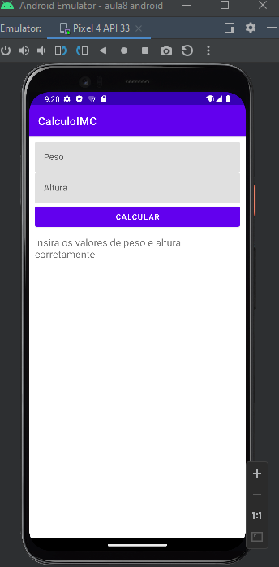
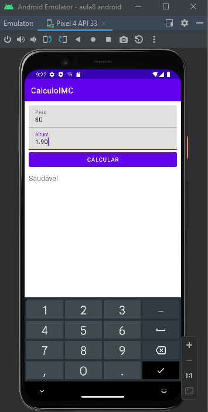
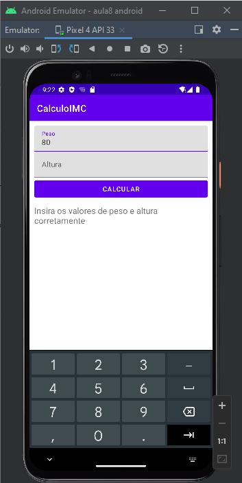
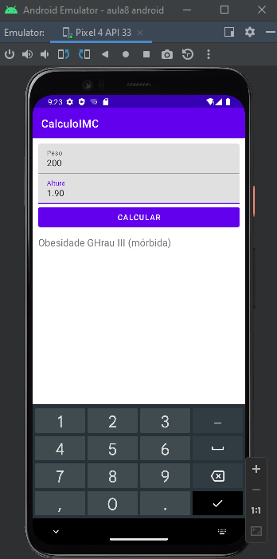

# Calculadora IMC
## Introdução
Utilização do framework para teste unitários o JUnit 4
## Atividades
- Construindo ambiente de teste unitários
- Frameworks de test
- Testes unitários essenciais

## Teste
| Cenários 1     | Cenário 2     |  
| ------------- | ------------- |
|||
|||
# VersionCode: 1.0

# Authors
Danilo Santos
[@danilopsnts](https://www.linkedin.com/in/danilopsnts/)